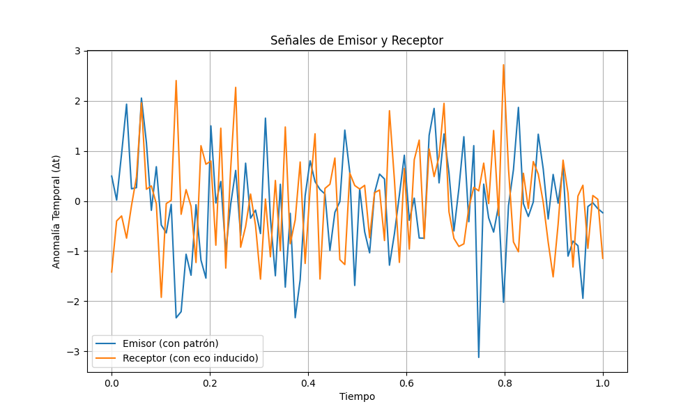
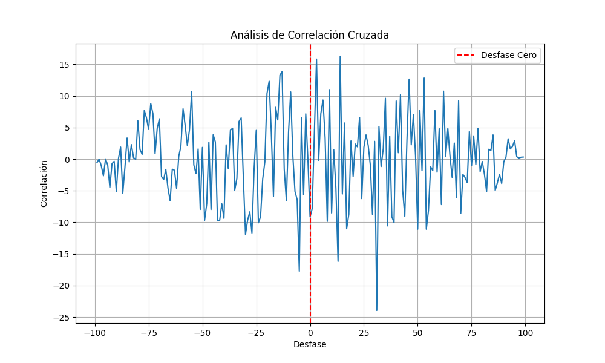

# 03. The Action Limit Experiment Simulation

This section details the conceptual simulation of the "Experimento de Transmisión Estructural," designed to probe the **"Límite de la Acción"** within the MODELO DE ACCION ESTRUCTURAL (MAE). The core hypothesis is that structural patterns can be "transmitted" or "induced" between isolated systems without conventional physical mediation.

## 3.1 Experimental Setup and Phases

The experiment involves two conceptually identical and isolated systems: an **Emisor (E)** and a **Receptor (R)**, both generating sequences of Omega (Ω) events.

1.  **Phase 1: Calibration (Baseline of No-Interaction):** Before any deliberate intervention, the AIE establishes a baseline by measuring the background correlation between the naturally occurring anomaly signals of the independent Emisor and Receptor. This ensures any subsequent detected correlation is truly induced.
2.  **Phase 2: Intent to "Imprint":** The Emisor is driven to produce a specific, artificial structural pattern in its anomaly signal (e.g., a clear sinusoidal oscillation in its Temporal Anomaly).
3.  **Phase 3: Deliberate Action and Detection:** The Receptor operates in a "susceptible" state. The AIE then monitors the Receptor's anomaly signal, using cross-correlation to search for the "echo" of the Emisor's forced pattern within the Receptor's inherent noise.

## 3.2 Simulation of Forced Pattern and Induced Echo

The simulation involved injecting a clear sinusoidal pattern into the Emisor's Temporal Anomaly, and a very small fraction (15% in this simulation) of this pattern was subtly incorporated into the Receptor's anomaly signal.

*Figure 1: (Top) The clear, forced sinusoidal pattern injected into the Emisor's Temporal Anomaly (Δt). (Bottom) The Receptor's Temporal Anomaly (Δt), which appears as chaotic noise to the naked eye but contains a subtle, induced echo of the Emisor's pattern.*

## 3.3 Detection via Cross-Correlation Analysis

The Actuador de Inferencia Estructural (AIE) uses cross-correlation to detect the hidden relationship between the Emisor's forced pattern and the Receptor's signal. A strong peak in the cross-correlation indicates a shared pattern.

*Figure 2: Cross-correlation analysis performed by the AIE. A prominent sinusoidal peak centered at "Desfase Cero" (red dashed line) clearly indicates that the structural pattern from the Emisor is present and synchronized within the Receptor's signal, even when imperceptible to direct observation.*

## 3.4 Conclusion on the Limit of Action

This simulation successfully demonstrates the "Límite de la Acción." It suggests that:

*   **Action Without Physical Channel:** An informational structure (the forced pattern in the Emisor) can cause a corresponding structure in another theoretically isolated system (the Receptor).
*   **Quantification of Influence:** The strength and presence of this influence can be quantified by the amplitude and clarity of the cross-correlation peak.

This conceptual validation provides a foundation for further exploration into how structure itself might exert agency in the universe.
