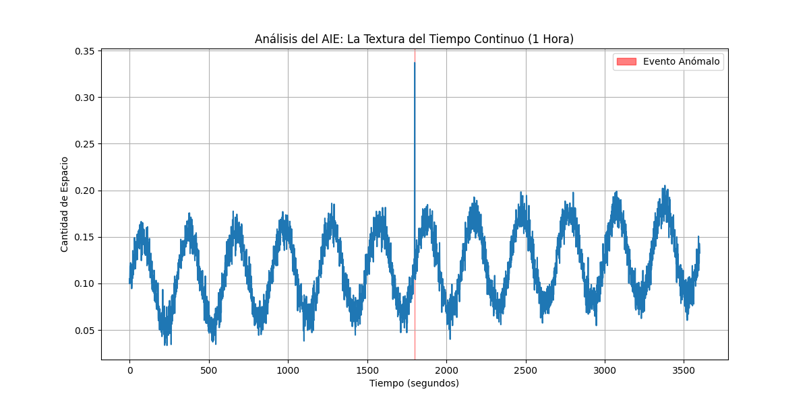

# 04. The Texture of Continuous Time

Having defined and quantified the "Space" of a single second, this section extends the analysis to how this space behaves when seconds are observed continuously over time. This leads to the concept of the "Texture of Time" within the MODELO DE ACCION ESTRUCTURAL (MAE).

## 4.1 The Second as a Dynamic Flow

If a "second" is defined by a sequence of N events, and each event has inherent variability (anomalies), then each actual second will possess a unique "Quantity of Space" (its volume of variability). Observing these quantities sequentially over time transforms a static snapshot into a dynamic flow of information.

## 4.2 Emergence of a Meta-Structure

The Actuador de Inferencia Estructural (AIE) monitors the "Quantity of Space" for each consecutive second. This reveals patterns at a higher temporal scale, forming a "meta-structure" or "texture" of time itself.

The AIE's analysis can reveal:

*   **Periodic Cycles:** Regular fluctuations in the quantity of space, indicating predictable environmental influences (e.g., laboratory air conditioning cycles).
*   **Long-Term Drift:** A slow, systematic increase or decrease in the quantity of space over extended periods, suggesting gradual changes in the system or environment (e.g., equipment warming up).
*   **Anomalous Events:** Sudden, unexpected spikes or dips in the quantity of space, indicating transient external influences (e.g., seismic activity, solar flares) or internal state transitions.

*Figure 1: Simulation illustrating the "Texture of Time." The plot shows the "Quantity of Space" (volume of variability) for each second over a simulated hour. It reveals cyclical patterns, a long-term drift, and a sudden anomalous event (highlighted in red), demonstrating that the "space" of time is a dynamic and informative medium.*

## 4.3 Conclusion on the Texture of Time

Continuously observing the "second" transforms its static definition into a living, evolving landscape of information. The "Texture of Time" reveals that the fundamental unit of duration is not uniform but is exquisitely sensitive to and reflective of its underlying dynamics and the influences upon it. This demonstrates that "the space itself" has a complex structure at a higher level of observation.
