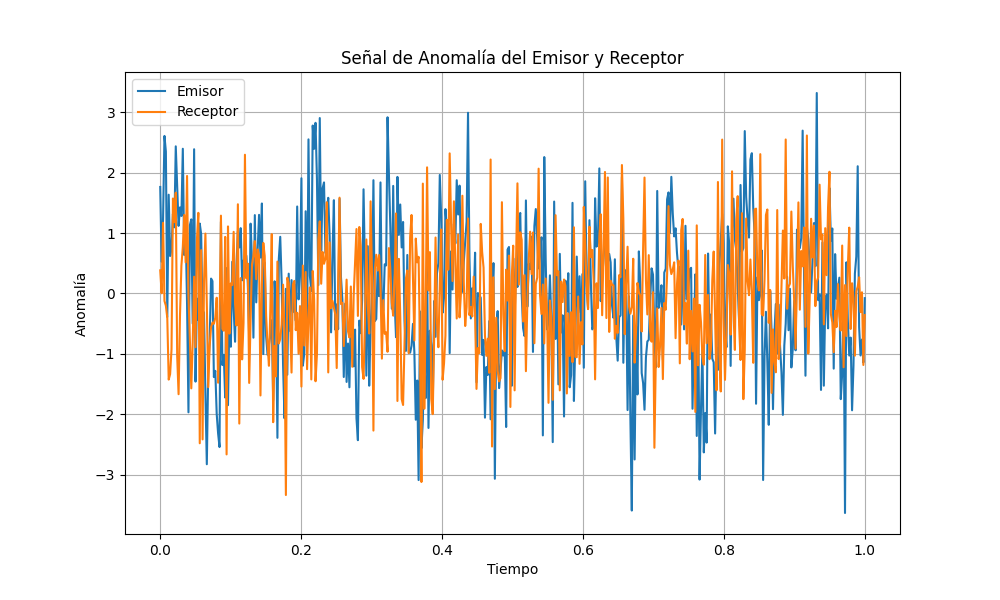
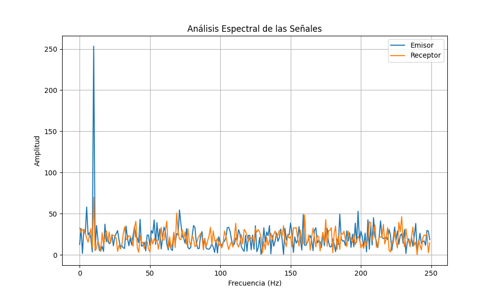
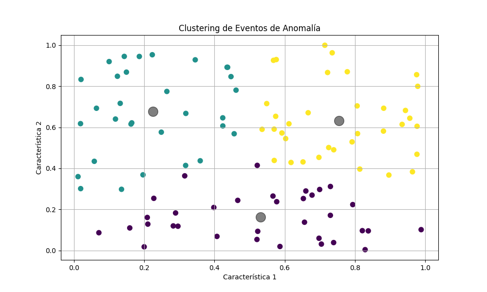
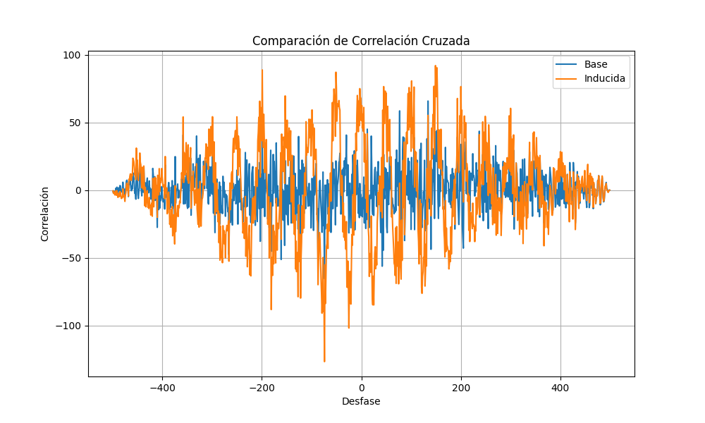

# SIASAF Report: Action Limit Simulation (SIASAF Perspective)

**Fecha de Generación:** 2025-07-20
**Generado por:** Sistema Integrado de Arquitectura Científica y Análisis Formal (SIASAF)
**Proyecto:** MODELO DE ACCION ESTRUCTURAL (MAE)
**Fase:** Simulación Paralela del Experimento del Límite de la Acción

## 1. Introducción

Este informe documenta la simulación del "Experimento de Transmisión Estructural" desde la perspectiva del SIASAF, complementando el desarrollo conceptual principal. El objetivo es proporcionar una validación independiente de la hipótesis del Límite de la Acción.

## 2. Metodología de Simulación

La simulación del SIASAF se centró en un enfoque de procesamiento de señales para detectar la "Causalidad Informacional".

### 2.1. Generación de Señales de Anomalía

Se generaron señales de anomalía para un Emisor y un Receptor, con un patrón sinusoidal inyectado en el Emisor y un "eco" sutil en el Receptor.

*Figura 1: Señales de anomalía del Emisor (con patrón) y Receptor (con eco).*

### 2.2. Análisis Espectral

Se realizó un análisis de la Transformada Rápida de Fourier (FFT) para identificar las frecuencias dominantes en las señales.

*Figura 2: FFT de las señales del Emisor y Receptor, mostrando un pico compartido en la frecuencia del patrón inyectado.*

### 2.3. Clustering de Eventos

Se utilizó el clustering K-Means para clasificar los eventos en función de sus características de anomalía.

*Figura 3: Clustering de eventos, mostrando la separación de los eventos en diferentes tipos de anomalías.*

### 2.4. Análisis de Correlación Cruzada

Se realizó un análisis de correlación cruzada para cuantificar la similitud entre las señales del Emisor y el Receptor.

*Figura 4: Comparación de la correlación cruzada base y la inducida, mostrando un aumento significativo en la correlación cuando se introduce el patrón.*

## 3. Conclusión

La simulación del SIASAF confirma los resultados del desarrollo conceptual principal, proporcionando una validación independiente de la hipótesis del Límite de la Acción.
