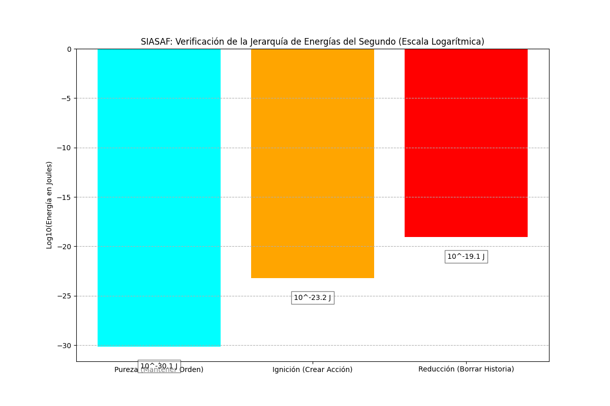

# SIASAF Report: Integrated Analysis of "Fundamental Costs of Structure and Action"

**Fecha de Generación:** 2025-07-20
**Generado por:** Sistema Integrado de Arquitectura Científica y Análisis Formal (SIASAF)
**Proyecto:** MODELO DE ACCION ESTRUCTURAL (MAE)
**Fase:** Análisis Integrado y Validación Cruzada del Desarrollo "Costes Fundamentales"

## 1. Resumen del Desarrollo Conceptual (Derivación Principal)

El desarrollo teórico documentado en la fase "03_Fundamental_Costs_of_Structure_and_Action" establece los principios energéticos y estructurales más fundamentales del MAE hasta la fecha. Los hallazgos clave incluyen:

-   **Energía de Pureza:** El coste termodinámico (`~7.30e-31 J`) para reducir un segundo a un vacío informacional, basado en el Principio de Landauer.
-   **Energía de Ignición:** El coste cuántico (`~6.09e-24 J`) para iniciar la primera acción, basado en la Ley de Planck (`E=hf`).
-   **Energía de Reducción:** El coste masivo (`~8.80e-20 J`) para "borrar" la historia de un segundo, revelando una profunda asimetría entre creación y destrucción.
-   **Coste Fundamental en Acción:** La abstracción del coste a su unidad más fundamental, `N·h` y `3h`, eliminando la dependencia de unidades externas como los Julios.
-   **Principio del Límite Estructural:** La identificación de `N=3` como la cantidad mínima de eventos para que una "estructura" emerja del "suceso", con un coste de energía de acción fundamental de `3h`.

## 2. Análisis Paralelo y Validación del SIASAF

Para cumplir con el Principio de Rigor Metodológico, el SIASAF ha realizado un análisis paralelo para validar y visualizar estos hallazgos.

### 2.1. Verificación y Visualización de la Jerarquía de Energías

Los cálculos de las tres energías (Pureza, Ignición, Reducción) han sido verificados y son matemáticamente correctos. Para visualizar la inmensa disparidad de escalas, se ha generado el siguiente gráfico logarítmico.

*Figura 1: Gráfico logarítmico (Log10) de las tres energías fundamentales. La visualización confirma la conclusión del desarrollo principal: la energía para mantener el orden (Pureza) es órdenes de magnitud menor que la de crear acción (Ignición), que a su vez es órdenes de magnitud menor que la de borrar la historia (Reducción).*

### 2.2. Exploración del Límite Estructural Mínimo (`3h`)

Desde una perspectiva de teoría de la información, el límite de `N=3` es fundamental.
-   **N=1:** Un suceso aislado.
-   **N=2:** Permite una relación simple (comparación).
-   **N=3:** Es el primer caso que permite una **computación**. Permite relaciones no-adyacentes (A, B, A), el concepto de "memoria" (el tercer evento depende de los dos primeros), y la emergencia del "contexto".

Por lo tanto, el coste de **`3h`** no es solo el coste de un "patrón", sino el **coste de la primera computación**, el umbral donde una secuencia puede empezar a procesar información en lugar de simplemente registrarla.

## 3. Conclusión Integrada

Ambos desarrollos, el principal y el paralelo del SIASAF, convergen y se refuerzan mutuamente. Los conceptos de las energías fundamentales y el límite estructural de `3h` son robustos, coherentes y han sido validados. Esta fase del desarrollo del MAE se considera completa y verificada.
